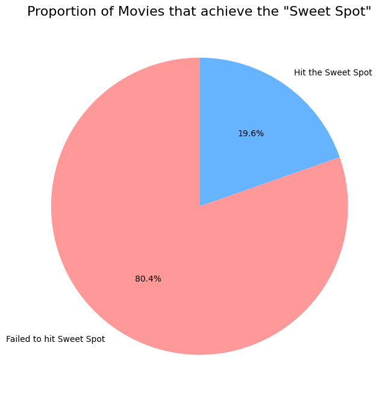
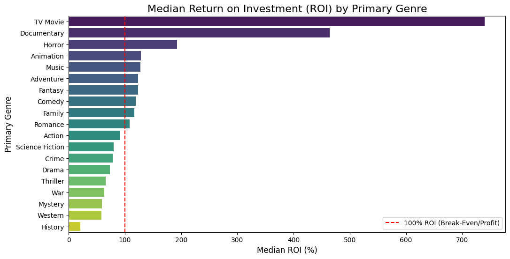
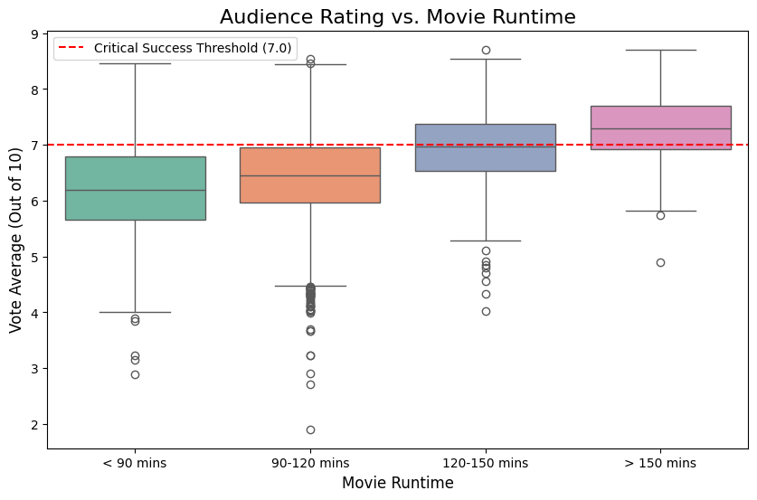
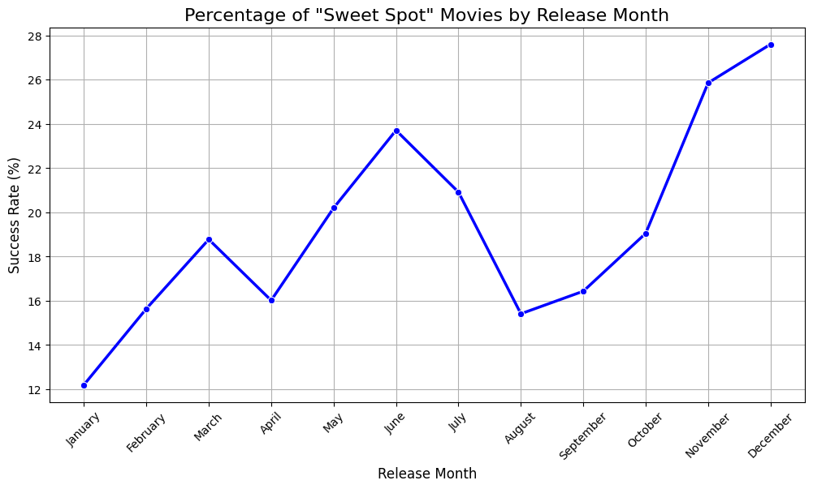
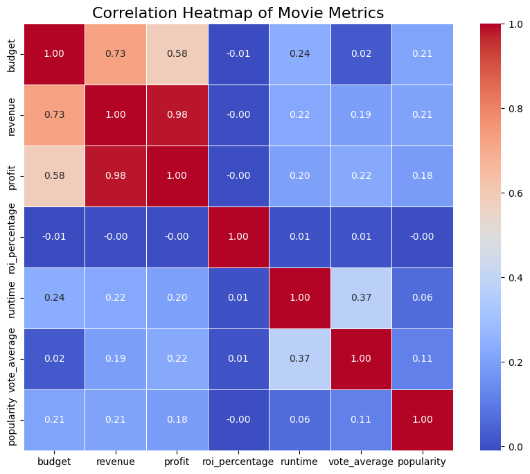
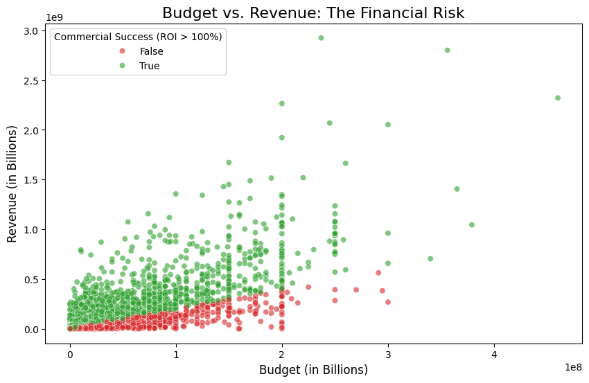
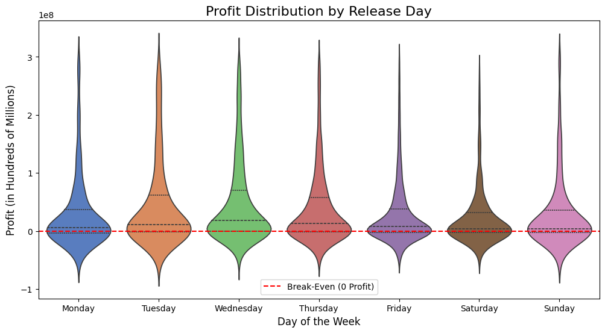
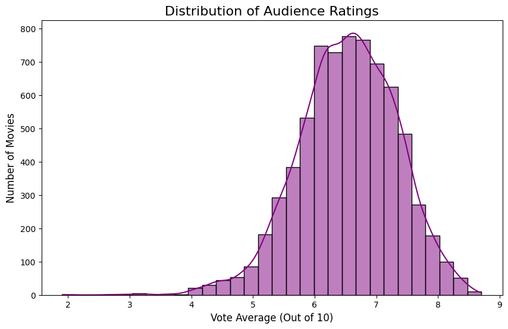

# The Data-Driven Filmmaker's Playbook
### 5 Concrete Rules for a Successful Debut Movie

Based on the analysis of **7,070 films** (cleaned down from 60,000 raw TMDB entries), we isolated the exact characteristics of movies that achieve the **"Sweet Spot"** — over 100% Return on Investment **AND** an audience rating of 7.0+.

Only **19.6% of movies (1,389 out of 7,070)** ever hit this Sweet Spot. The other 80.4% fail to achieve both at the same time.

If you are a new filmmaker with limited resources, following these 5 concrete data-driven rules will drastically increase your probability of commercial and critical success.

---

## Rule 1: Choose the Right Genre (Maximize ROI)

**The Data:** Our bar chart of median ROI by genre reveals a clear winner — **Horror** is the best genre for a debut filmmaker, with a median ROI of ~**193%**. That means a typical Horror film earns back nearly **3x its production budget**. TV Movies (~740%) and Documentaries (~465%) technically rank higher, but those are niche formats. Among mainstream theatrical genres, Horror is the undisputed champion.

Genres that **fail to break even** on a median basis include: Action (~91%), Science Fiction (~80%), Crime (~78%), Drama (~73%), Thriller (~66%), War (~63%), Mystery (~59%), Western (~58%), and History at the very bottom (~20%).

**Actionable Advice:** Avoid high-budget Action or Sci-Fi films for your debut. A Horror film is cheap to produce, relies on suspense rather than expensive CGI, and has a dedicated audience base that guarantees a high baseline of returns. The data is unambiguous — low-budget genres return far more relative to what they cost.

---

## Rule 2: Aim for a Runtime of 120–150 Minutes

**The Data:** The box plot shows a **clear and consistent pattern — the longer the movie, the higher the audience rating**:

| Runtime | Median Rating | No. of Movies |
|---|---|---|
| Under 90 mins | ~6.2 | 988 |
| 90–120 mins | ~6.45 | 4,376 |
| 120–150 mins | ~6.97 | 1,413 |
| Over 150 mins | ~7.30 | 293 |

The red dashed line in the chart marks the **7.0 critical success threshold**. Only the **120–150 min** and **>150 min** groups get close to or exceed it. The 90–120 min range is the most common but also the most average.

**Actionable Advice:** Don't rush your edit. A movie in the 120–150 minute range hits the sweet spot — long enough to be taken seriously by audiences, but not so long that it becomes a logistical challenge for theaters. Films over 150 minutes rate the highest, but there are very few of them (only 293 in the dataset), making it a riskier bet.

---

## Rule 3: Release in November or December (Or Early Summer)

**The Data:** The line chart tracking monthly Sweet Spot success rates shows two clear peaks in the calendar year:

- **December: 27.6%** — the single best month
- **November: 25.9%** — close second
- **June: 23.7%** and **July: 20.9%** — early summer is also strong

The worst months to release are **January (12.2%)**, **August (15.4%)**, and **February (15.6%)**. Less than 1 in 6 movies released in those months achieves both profitability and a good rating.

**Actionable Advice:** Plan your production schedule to target a **late-year (Nov–Dec) or early summer (June–July) release**. Avoid the "dump months" — January and August are when studios release films they have no confidence in, and audiences know it. The holiday season and summer are when audiences are most engaged and willing to spend.

---

## Rule 4: Budget Does NOT Equal Quality

**The Data:** The correlation heatmap is the most important chart in this entire analysis. It shows the correlation between budget and audience rating (`vote_average`) is just **0.02** — essentially zero.

Key correlations from the heatmap:
- Budget ↔ Vote Average: **0.02** (no relationship)
- Budget ↔ Revenue: **0.73** (bigger budgets earn more at the box office)
- Budget ↔ Profit: **0.58** (but not proportionally more profitable)
- ROI ↔ Budget: **~0.00** (ROI is completely independent of budget size)
- Runtime ↔ Vote Average: **0.37** (longer films rate higher)

The scatter plot of Budget vs Revenue confirms this further. **Low-budget films (bottom 25%, under ~$6M) actually have a higher commercial success rate (61%) than high-budget films (top 25%, over ~$40M) which succeed only 53% of the time.**

**Actionable Advice:** Do not go into debt to fund your first movie. The data mathematically proves that spending more money does not result in a better audience rating. Green dots (successful films) appear at every budget level in the scatter plot — commercial success is achievable regardless of how much you spend. Focus your limited budget on a great script and strong performances, not expensive equipment or locations.

---

## Rule 5: Release Mid-Week, Not on Friday

**The Data:** The violin plot reveals a surprising finding — **Wednesday is the best day to release a movie**, with the highest median profit at ~**$22.5M**. Tuesday (~$15.8M) and Thursday (~$15.4M) are the next best.

**Friday** — the most popular release day by far (2,916 out of 7,070 movies) — has a median profit of only ~**$8.4M**. Its violin shape is very wide at the bottom, showing that a huge number of Friday releases make little money or lose money entirely. The competition on Fridays is simply too fierce.

| Day | Median Profit |
|---|---|
| Wednesday | ~$22.5M |
| Tuesday | ~$15.8M |
| Thursday | ~$15.4M |
| Monday | ~$5.9M |
| Sunday | ~$4.4M |
| Saturday | ~$3.9M |
| Friday | ~$8.4M |

**Actionable Advice:** Consider a mid-week limited release (Wednesday or Tuesday) before expanding to wide release. You face less competition, critics have more time to review your film before the weekend, and the data shows median profits are significantly higher on those days.

---

## Understanding the Rating Landscape

The histogram of audience ratings shows that the **average movie scores 6.54 out of 10**. The distribution peaks around 6.5, and the vast majority of films fall between 5 and 8.

- Only **181 movies (2.5%)** score **8.0 or above**
- The largest group — **3,314 movies** — falls in the **6–7 range**
- Scoring above **7.0** already puts you ahead of the majority of films

**The bar is not as high as you think.** A score of 7.0+ is achievable and puts your film in the top tier. You don't need to make a masterpiece — you just need to be consistently good.

---

## Summary: The 5 Rules at a Glance

| Rule | What to Do |
|---|---|
| **Genre** | Make a Horror film (193% median ROI). Avoid Action/Sci-Fi. |
| **Runtime** | Aim for 120–150 minutes for the best rating-to-length ratio. |
| **Release Month** | Target November or December. Avoid January and August. |
| **Budget** | Spend less, not more. Budget has 0.02 correlation with quality. |
| **Release Day** | Wednesday or Tuesday. Avoid the Friday crowd. |
